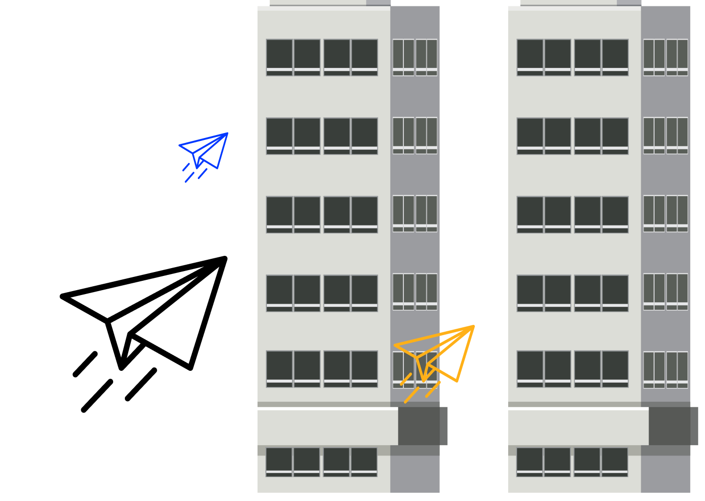
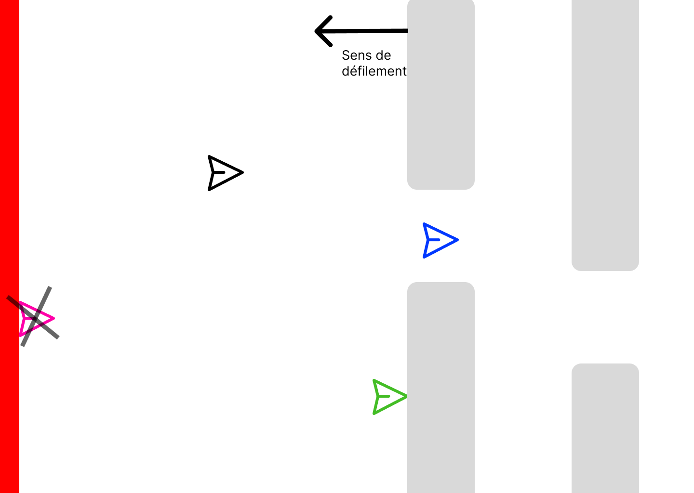
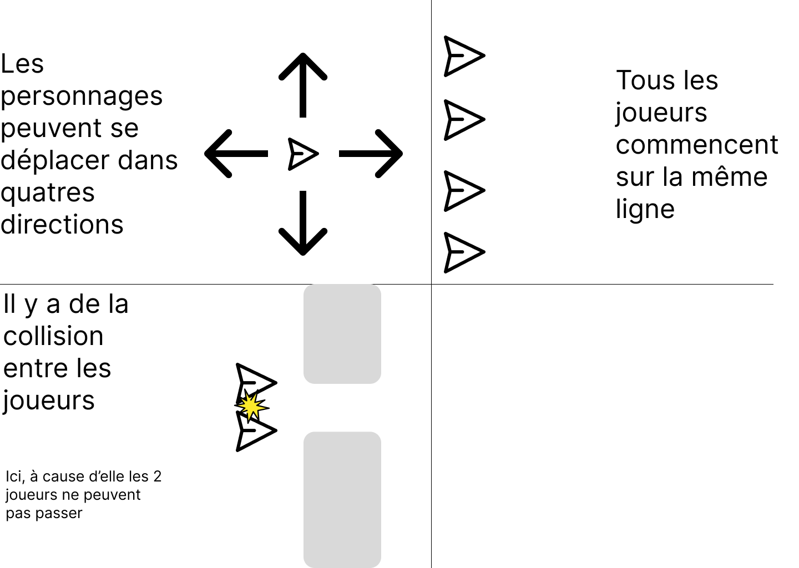
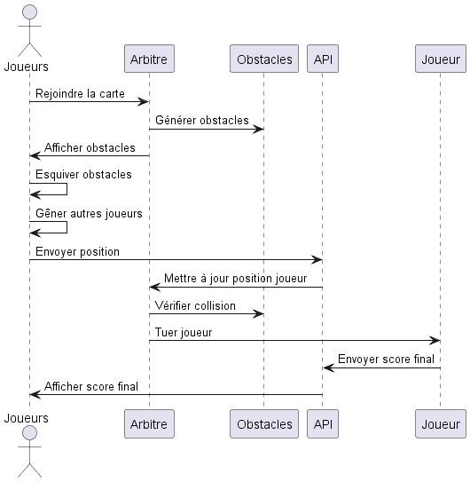
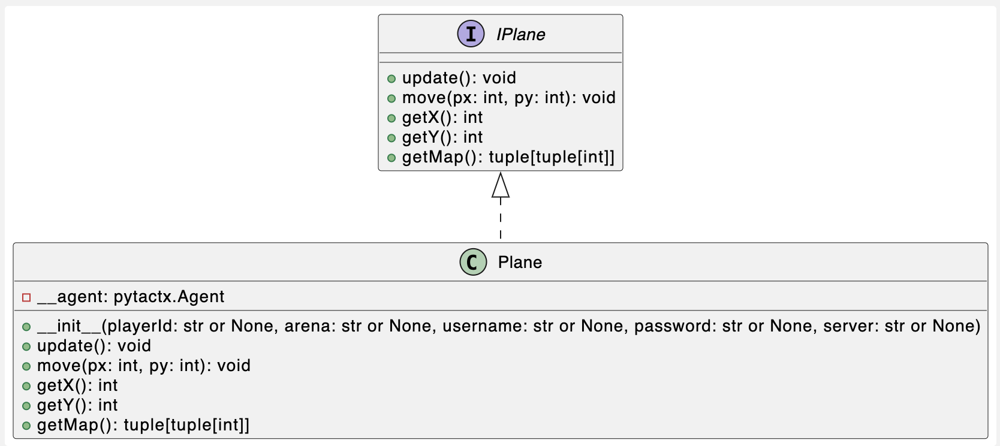
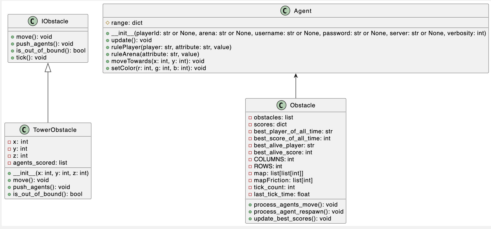

# Flappy Plane

Un jeu d'esquive d'obstacle où les joueurs doivent programmer leurs propres robots !
### 🎯 Contexte & cahier des charges :
Développé dans le cadre d'une formation, le flappy plane doit être un nouveau mode de jeu pour PytactX (voir [jusdeliens.com](https://jusdeliens.com)) et permettre au groupe de monter en compétences en python en mettant en pratique les principes SOLID.

### 🎲 Règles du jeu :
Les joueurs rejoignent la carte et doivent esquiver les différents obstacles, il est possible de gêner les autres joueurs en se mettant devant eux.
Si un joueur est touche le mur de gauche, il meurt et obtient alors un score en fonction final correspondant au nombre d'obstacles passés.

### 🎮 Use cases :
#### Administrateur : 
- L'administrateur peut configurer l'arène via le fichier d'options.
#### Joueur :
- Si vous êtes un joueur, référez vous au [README_API](src/api/README_API.md)
## 📞 Diagramme de séquence :

## 📞 Diagramme de classe :

------------------------------------------------------

## ✅ Pré-requis
En tant qu'administrateur vous aurez besoin de python 3.12 pour exécuter le projet.
Si vous voulez faire votre propre robot pour jouer au jeu, consultez [le read me de l'API](src/api/README_API.md) à la place
## ⚙️ Installation :
L'installation des packages sont automatiquements faits lors de la création d'un agent.
## 🧪 Tests:
- Test API :
  - Mouvement de l'agent
- Test Server :
  - Mouvement de l'obstacle
  - Collision d'un agent avec un obstacle
## 🛣️ Roadmap
- [x] Jeu de base en FFA continu
- [ ] Manches
- [ ] Mode Battle Royale
- [ ] Equipes
- [ ] Collectables
## 🧑‍💻 Auteurs
- Augustin BUKIN ([Nehocute](https://github.com/Nehocute))
- Théo LEBIEZ ([Deeffault](https://github.com/Deeffault))
- Teiva TESSON ([teidova](https://github.com/teidova))
- Samy VASSE ([samy313](https://github.com/samy313))
## Dépendances
- librairie j2l (auteur: [jusdeliens.com](https://jusdeliens.com))
## ⚖️ License

Background image by vectorpocket on Freepik :  
<a href="https://www.freepik.com/free-vector/neon-megapolis-background-with-buildings-skyscrapers_3586320.htm?query=city%20towers#from_view=detail_alsolike">Link</a> 

MIT License

Copyright (c) 2023 Augustin BUKIN, Théo LEBIEZ, Teiva TESSON, Samy VASSE

Permission is hereby granted, free of charge, to any person obtaining a copy
of this software and associated documentation files (the "Software"), to deal
in the Software without restriction, including without limitation the rights
to use, copy, modify, merge, publish, distribute, sublicense, and/or sell
copies of the Software, and to permit persons to whom the Software is
furnished to do so, subject to the following conditions:

The above copyright notice and this permission notice shall be included in all
copies or substantial portions of the Software.

THE SOFTWARE IS PROVIDED "AS IS", WITHOUT WARRANTY OF ANY KIND, EXPRESS OR
IMPLIED, INCLUDING BUT NOT LIMITED TO THE WARRANTIES OF MERCHANTABILITY,
FITNESS FOR A PARTICULAR PURPOSE AND NONINFRINGEMENT. IN NO EVENT SHALL THE
AUTHORS OR COPYRIGHT HOLDERS BE LIABLE FOR ANY CLAIM, DAMAGES OR OTHER
LIABILITY, WHETHER IN AN ACTION OF CONTRACT, TORT OR OTHERWISE, ARISING FROM,
OUT OF OR IN CONNECTION WITH THE SOFTWARE OR THE USE OR OTHER DEALINGS IN THE
SOFTWARE.
